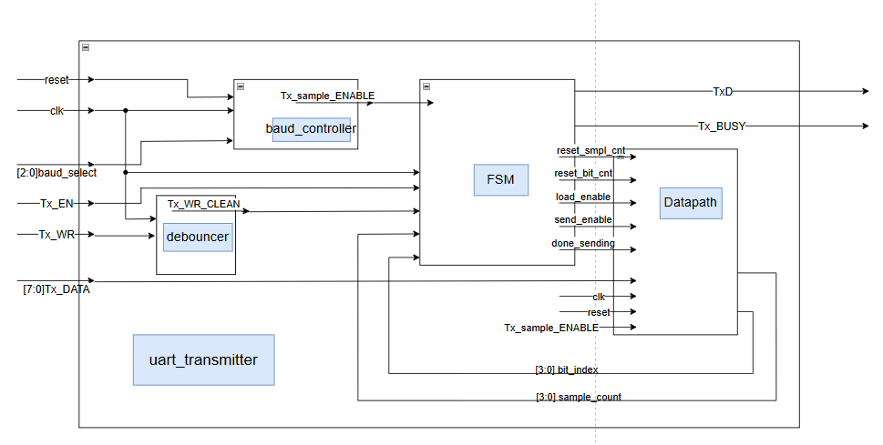
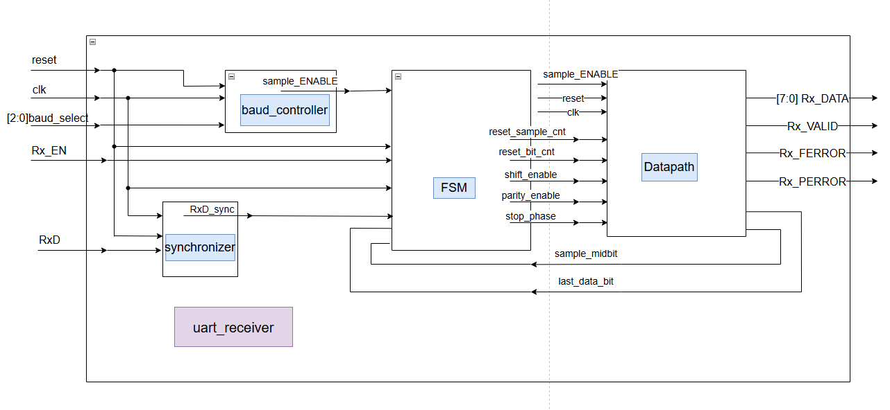
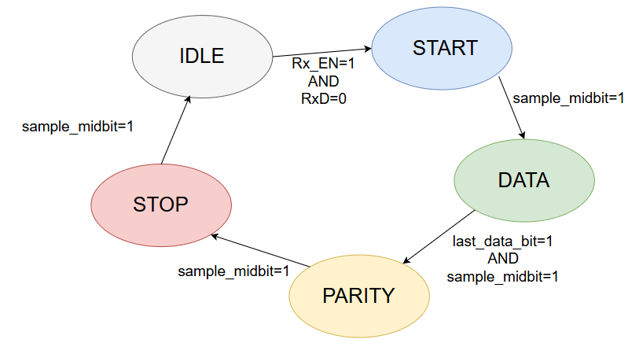
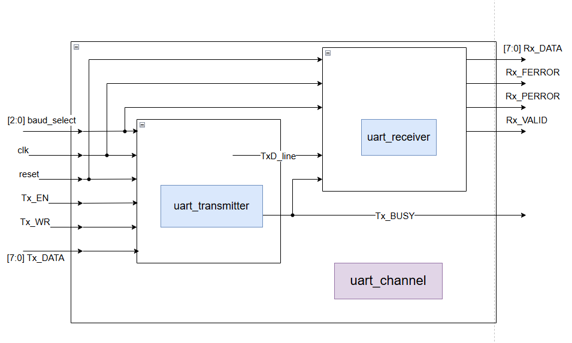
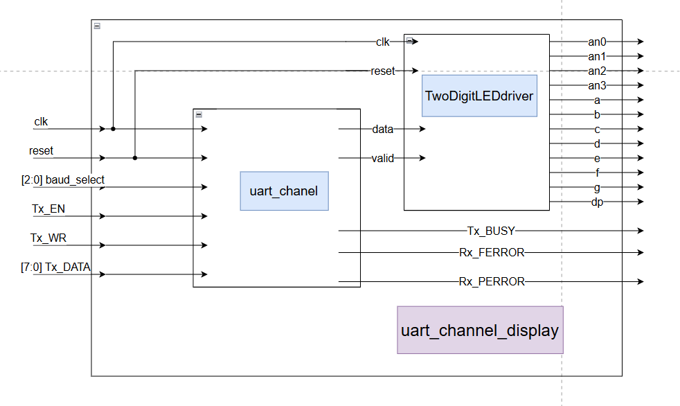

# FPGA UART Communication Subsystem

A modular UART transmitter and receiver subsystem implemented in Verilog and deployed on a Boolean Board with a Xilinx Spartan-7 XC7S50-CSGA324-1 FPGA. The design includes selectable baud rates, 16× receiver oversampling, parity and framing error detection, asynchronous input synchronization, push-button debouncing, internal Tx-to-Rx loopback integration, and hexadecimal display of received bytes on a seven-segment display.

## Features

- UART transmitter with FSM-based control and parallel-to-serial conversion
- UART receiver with separate control FSM and datapath
- 16× receiver oversampling with mid-bit sampling
- Eight selectable baud rates from 300 to 115200 baud
- 8-bit data transmission
- Even parity generation and checking
- Stop-bit validation and framing-error detection
- Two-flip-flop synchronization of the asynchronous `RxD` input
- Debounced transmit-write push-button with single-cycle pulse generation
- Internal transmitter-to-receiver loopback integration
- Four-digit seven-segment display output with the received byte shown in the two least-significant hexadecimal digits and zeros in the two upper digits
- Dedicated transmitter, receiver, loopback, and display integration testbenches
- Hardware implementation and validation on a Spartan-7 FPGA

## UART frame format

The implemented UART frame contains:

- one start bit
- eight data bits transmitted least-significant bit first
- one even-parity bit
- one stop bit

The transmitter computes the parity bit from the eight-bit input byte. The receiver accumulates parity across the received data bits and compares the result with the received parity bit.

## Baud-rate selection

A shared baud controller generates the sampling-enable pulses used by both the transmitter and receiver.

| `baud_select` | Baud rate |
|---|---:|
| `000` | 300 |
| `001` | 1,200 |
| `010` | 4,800 |
| `011` | 9,600 |
| `100` | 19,200 |
| `101` | 38,400 |
| `110` | 57,600 |
| `111` | 115,200 |

The receiver uses 16× oversampling. Incoming serial data is sampled near the middle of each UART bit period using an internal four-bit sample counter.

## System architecture

The design separates communication control, datapath operations, synchronization, timing generation, and display functionality into individual modules.

### UART transmitter

The transmitter accepts an eight-bit parallel word and serializes it into a UART frame containing the start bit, data bits, parity bit, and stop bit.

Transmission is controlled by an FSM with four states:

- `IDLE`
- `LOAD`
- `SEND`
- `DONE`

A debouncer processes the physical `Tx_WR` push-button. The input is first synchronized to the 100 MHz system clock and, after remaining stable for the debounce interval, produces a clean single-cycle transmit request.



### UART receiver

The receiver contains four main components:

- asynchronous input synchronizer
- baud controller
- receiver control FSM
- receiver datapath

The asynchronous `RxD` signal first passes through a two-flip-flop synchronizer before entering the receive control and datapath logic.

The datapath performs 16× oversampling and samples each UART bit near its midpoint. It reconstructs the eight-bit word and checks the received parity and stop bits.

The receiver generates:

- `Rx_DATA`
- `Rx_VALID`
- `Rx_PERROR`
- `Rx_FERROR`



### Receiver FSM

The receiver FSM controls start-bit detection, sample-counter alignment, data shifting, parity checking, and stop-bit checking.



### UART channel

The `uart_channel` module integrates the transmitter and receiver into an internal loopback configuration.

The transmitter serial output is connected directly to the receiver serial input inside the module.

```text
Tx_DATA
   |
   v
UART Transmitter
   |
   | TxD
   v
Internal serial line
   |
   v
UART Receiver
   |
   v
Rx_DATA
```

This configuration exercises the complete transmit and receive path without requiring an external serial connection between the two modules.



### UART channel with display

A successfully received byte is stored and shown on the four-digit seven-segment display. The received byte occupies the two least-significant hexadecimal digits, while the two upper digits display zero.

The `uart_channel_display` module extends the internal loopback channel with a seven-segment display subsystem.

A successfully received byte is stored and displayed as two hexadecimal digits.



## Repository structure

```text
fpga-uart-subsystem-verilog/
├── rtl/
│   ├── top/
│   │   ├── uart_channel.v
│   │   └── uart_channel_display.v
│   ├── tx/
│   │   └── uart_transmitter.v
│   ├── rx/
│   │   ├── uart_receiver.v
│   │   ├── uart_rx_fsm.v
│   │   └── uart_rx_datapath.v
│   ├── common/
│   │   ├── baud_controller.v
│   │   ├── synchronizer.v
│   │   └── debouncer.v
│   └── display/
│       ├── TwoDigitLEDdriver.v
│       └── LEDdecoder.v
├── tb/
│   ├── tb_baud_controller.v
│   ├── tb_uart_transmitter.v
│   ├── tb_uart_receiver.v
│   ├── tb_uart_channel.v
│   └── tb_uart_channel_display.v
├── constraints/
│   ├── uart_transmitter.xdc
│   ├── uart_receiver.xdc
│   └── uart_channel_display.xdc
└── docs/
    ├── tx_block_diagram.png
    ├── tx_fsm.png
    ├── rx_block_diagram.png
    ├── rx_fsm.png
    ├── uart_channel_block_diagram.png
    └── uart_channel_display_block_diagram.png
```

## Available configurations

The repository contains separate configurations for standalone transmit, standalone receive, internal loopback, and loopback with display.

### Standalone transmitter

Top module:

```text
uart_transmitter
```

Constraints:

```text
constraints/uart_transmitter.xdc
```

This configuration exposes `TxD` as an external UART transmit signal.

The hardware interface includes:

- `Tx_DATA[7:0]` on board switches
- `baud_select[2:0]` on board switches
- `Tx_EN` on a board switch
- `Tx_WR` on a push-button
- `Tx_BUSY` on an LED
- `TxD` on the board UART transmit connection

### Standalone receiver

Top module:

```text
uart_receiver
```

Constraints:

```text
constraints/uart_receiver.xdc
```

This configuration accepts an external asynchronous `RxD` signal.

The hardware interface includes:

- `RxD` from the board UART receive connection
- `baud_select[2:0]` on board switches
- `Rx_EN` on a board switch
- `Rx_DATA[7:0]` on eight LEDs
- `Rx_VALID` on a status LED
- `Rx_PERROR` on a status LED
- `Rx_FERROR` on a status LED

### Internal loopback channel

Integration module:

```text
uart_channel
```

The transmitter and receiver are connected internally through the serial data path.

### Internal loopback with display

It connects the transmitter output internally to the receiver input and displays successfully received data in the two least-significant hexadecimal digits of the onboard four-digit seven-segment display.

Top module:

```text
uart_channel_display
```

Constraints:

```text
constraints/uart_channel_display.xdc
```

This is the most complete integrated configuration in the repository.

It connects the transmitter output internally to the receiver input and displays successfully received data on the onboard seven-segment display.

## Clocking and CDC

The main UART logic operates from the 100 MHz FPGA system clock.

The external `RxD` signal is asynchronous with respect to this clock. A dedicated two-flip-flop synchronizer is used before the signal reaches the receiver FSM and datapath.

The physical `Tx_WR` push-button is also synchronized inside the debouncer before a clean single-cycle transmit request is generated.

The seven-segment display subsystem uses an MMCM to generate a separate 5 MHz clock for display multiplexing.

Received data is first stored in a register operating in the 100 MHz system-clock domain. The stored value remains stable between successful receptions while the display logic reads the corresponding hexadecimal digits.

The current implementation does not include a dedicated handshake between the 100 MHz UART domain and the 5 MHz display-multiplexing domain. Because the registered display value changes only when a new valid byte is accepted and otherwise remains stable, this implementation was sufficient for the intended FPGA demonstration. A dedicated CDC handshake would be appropriate in a more general-purpose design where the transferred data could change continuously.

## Vivado project setup

1. Create a new RTL project in AMD/Xilinx Vivado for the `XC7S50-CSGA324-1` device.
2. Add the required Verilog files under `rtl/`.
3. Select the desired top module.
4. Add the corresponding XDC file from `constraints/`.
5. Run synthesis and implementation.
6. Generate the bitstream.
7. Program the Boolean Board.

The supplied constraints files contain the 100 MHz input-clock constraint and the physical FPGA pin assignments used by the corresponding hardware configurations.

## Target hardware

- Boolean Board
- Xilinx Spartan-7 `XC7S50-CSGA324-1`
- 100 MHz system clock
- onboard switches and push-buttons
- onboard LEDs
- onboard four-digit seven-segment display
- UART interface for serial communication

## Implementation results

The final `uart_channel_display` design was synthesized, placed, and routed in **Vivado 2021.2** for the **Xilinx Spartan-7 XC7S50-CSGA324-1** device.

### Resource utilization

| Resource | Used | Available | Utilization |
|---|---:|---:|---:|
| Slice LUTs | 111 | 32,600 | 0.34% |
| Slice Registers | 122 | 65,200 | 0.19% |
| Slices | 41 | 8,150 | 0.50% |
| Block RAM Tiles | 0 | 75 | 0.00% |
| DSPs | 0 | 120 | 0.00% |
| Bonded IOBs | 30 | 210 | 14.29% |
| BUFGs | 2 | 32 | 6.25% |
| MMCMs | 1 | 5 | 20.00% |

The datapath and control logic are implemented using LUTs and registers, with no block RAM or DSP resources required.

### Clock and timing summary

| Clock domain | Frequency | Purpose |
|---|---:|---|
| System clock | 100.000 MHz | UART logic, baud generation, synchronization, and control |
| Display clock | 5.000 MHz | Seven-segment display multiplexing |

Post-route static timing analysis reported:

| Metric | Result |
|---|---:|
| Setup WNS | +5.258 ns |
| Setup TNS | 0.000 ns |
| Hold WHS | +0.131 ns |
| Hold THS | 0.000 ns |

The 100 MHz system-clock domain achieved a setup WNS of **+5.258 ns**. The generated 5 MHz display-clock domain achieved a setup WNS of **+197.992 ns**.

All user-specified timing constraints were met by the routed implementation.


## Verification

The repository includes behavioral testbenches for the baud controller, transmitter, receiver, integrated UART channel, and channel-with-display configuration.

### Baud controller

`tb_baud_controller.v` exercises all eight `baud_select` configurations and observes the corresponding `sample_ENABLE` pulse generation.

The tested selections cover baud rates from 300 to 115200 baud.

### UART transmitter

`tb_uart_transmitter.v` exercises transmission of multiple data bytes and allows inspection of:

- serialized `TxD`
- transmission timing
- `Tx_BUSY` behavior
- repeated transmission operation

This testbench is primarily intended for waveform-based inspection.

### UART receiver

`tb_uart_receiver.v` generates UART frames directly and contains explicit PASS or FAIL checks for:

- correct byte reception
- parity-error detection
- framing-error detection

The testbench verifies that a valid frame produces the expected `Rx_DATA` value without parity or framing errors.

It also deliberately injects an incorrect parity bit and an incorrect stop bit to verify the corresponding error-detection logic.

### Integrated UART channel

`tb_uart_channel.v` sends four test bytes through the complete internal transmitter-to-receiver loopback path:

- `0x55`
- `0xAA`
- `0x5A`
- `0xC3`

The testbench monitors the received byte together with the parity and framing status flags.

This integration testbench is intended primarily for waveform and console-based inspection rather than automated PASS or FAIL checking.

### UART channel with display

`tb_uart_channel_display.v` exercises the integrated UART and seven-segment display path using the following transmitted values:

- `0x12`
- `0x34`
- `0xAB`
- `0xFE`

This testbench is also intended primarily for integration and waveform inspection.

## Hardware validation

The UART subsystem was implemented and tested on the Boolean Board using the Xilinx Spartan-7 `XC7S50-CSGA324-1` FPGA.

The standalone transmitter and receiver configurations provide external UART connections for communication with a PC through the board serial interface.

External serial communication was tested using a USB-to-UART connection and PuTTY as the serial terminal.

The standalone transmitter configuration was used to transmit serial data from the FPGA, while the receiver configuration was used to receive serial data and expose the decoded byte and status flags through the onboard LEDs.

The integrated `uart_channel_display` configuration was also synthesized, programmed, and tested on the FPGA. In this configuration, the transmitter and receiver are connected internally and successfully received bytes are displayed in the two least-significant hexadecimal digits of the four-digit seven-segment display, with zeros shown in the two upper digits.

## Tools and hardware

- Verilog HDL
- AMD/Xilinx Vivado
- Boolean Board
- Xilinx Spartan-7 `XC7S50-CSGA324-1` FPGA
- USB-to-UART serial interface
- PuTTY or equivalent serial terminal

## Academic context and attribution

This project was developed as the **second laboratory project** of the **Digital Systems Laboratory** course at the **Department of Electrical and Computer Engineering, University of Thessaly** during the **Winter Semester 2025–2026**.

The core assignment covered the design and verification of a UART subsystem consisting of a baud-rate controller, transmitter, receiver, and integrated transmitter-to-receiver channel. The RTL in this repository represents the implementation prepared and submitted for the course.

As an optional extension, I integrated the UART channel with the onboard seven-segment display. The display subsystem was adapted from the driver developed for the first laboratory project so that received UART bytes could be stored and displayed in hexadecimal form.

The repository was later reorganized into a clearer structure for portfolio and educational review. The original course specification defined the required functionality. Any course-provided starter or verification material, if present in the original laboratory package, is not claimed here as original work.

No open-source license is currently provided. The code is shared for portfolio and educational review purposes.